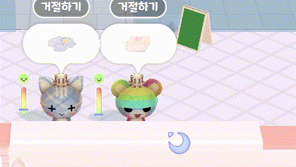

# EditorScript와 ScriptableObject를 이용한 커스터마이징 손님

## 결과 미리보기



## 개요

- TodangTodang 구현사항 중 손님을 에디터의 Inspector 상에서 커스터 마이징 가능하도록 구현한 내용을 설명한 문서입니다.
- 사용 기술
    - ScriptableObject
    - EditorScript

## 구현 사항

- 손님의 외관 설정 기능
    
    
    
    - 상세 설명
        - 완전 랜덤으로 캐릭터 외관 설정 시 이상한 모습으로 나오는 캐릭터 존재
        - 이에 따라 **커스텀된 캐릭터를 랜덤 생성**하는 것이 좋다고 판단.
        - ScriptableObject로 활용하여, 각종 에셋을 ScriptableObject에 포함하는 형태로 제작
        - 성과
            - 손님 각각이 SO를 통해 외관 설정을 하므로, **내부필드의 경량화**(메모리 절약)
            - 데이터만을 교체하고 사용하기 때문에 손님의 **외관 정보의 추가/삭제**가 용이함
    - 관련 코드
        - CustomerDecoDataSO.cs
        
        외관을 설정하는 ScriptableObject
        
        ```csharp
        [CreateAssetMenu(menuName = "ScriptableObjects/Customer/CustomerDecoData", fileName = "CustomerDecoData")]
        public class CustomerDecoDataSO : ScriptableObject
        {
            [field: SerializeField] public Mesh BodyMesh { get; private set; }
            [field: SerializeField] public Material BodyMaterial { get; private set; }
            [field: SerializeField] public CustomerFaceDecoSetSO FaceSet { get; private set; }
            [field: SerializeField] public GameObject[] Accessories { get; private set; }
        }
        ```
        
        - CustomerGenerator.cs
        
        외관들을 저장한 배열에서 랜덤으로 뽑아 적용 시키는 부분
        
        ```csharp
        private Customer InitCustomerObject(GameObject obj, int seatIdx)
        {
        //... 중간 생략 ...
        		if (obj.TryGetComponent<CustomerWear>(out wear))
        		{
        				CustomerDecoDataSO decoDataSO = _customerDecoDataSo[randomDecoIdx];
        			  wear.SetBodyMesh(decoDataSO.BodyMesh, _customerDecoDataSo[randomDecoIdx].BodyMaterial);
        			  wear.SetFaceMesh(decoDataSO.FaceSet);
        		}
        //... 중간 생략 ...
        }
        ```
        
        - CustomerWear.cs
        
        외관들을 적용시키는 부분, 사본 생성의 방지를 위해 sharedMaterial 사용
        
        ```csharp
        public void SetBodyMesh(Mesh bodyMesh,Material bodyMaterial)
        {
            BodyRenderer.sharedMesh = bodyMesh;
            BodyRenderer.sharedMaterial = bodyMaterial;
        }
        ```
        
      
        

- 표정 기능 (머테리얼 사본 생성 방지)
    
    
    
    - 관련 코드
        
        외관 전체를 관리하는 스크립트
        
        CustomerWear.cs
        
        ```csharp
        public void SetFaceMesh(CustomerFaceDecoSetSO faceSet)
        {
            FaceSet = faceSet;
            SetFace(Enums.FaceType.Normal);
        }
        
        public void SetFace(Enums.FaceType type)
        {
            FaceRenderer.sharedMaterial = FaceSet.GetFaceSet(type);
        }
        ```
        
        표정을 가지고있는 ScriptableObject
        
        CustomerFaceDecoSetSO.cs
        
        ```csharp
        [CreateAssetMenu(menuName = "ScriptableObjects/Customer/CustomerFaceSet", fileName = "CustomerFaceSet")]
        public class CustomerFaceDecoSetSO : ScriptableObject
        {
            [Header("Normal, Angry, Happy 순으로 배치")]
            [SerializeField] private Material[] faceSet;
            public Material GetFaceSet(Enums.FaceType type)
            {
                return faceSet[(int)type];
            }
        }
        ```
        
        표정을 Inspector에서 쉽게 확인할 수 있도록 추가한 EditorScript
        
        CustomerFaceDecoSetSOEditorScript.cs
        
        ```csharp
        [CustomEditor(typeof(CustomerFaceDecoSetSO))]
        public class CustomerFaceDecoSetSOEditorScript : Editor
        {
            private CustomerFaceDecoSetSO data;
            
            private void Awake()
            {
                data = target as CustomerFaceDecoSetSO;
            }
        
            public override void OnInspectorGUI()
            {
                base.OnInspectorGUI();
        
                GUILayout.BeginHorizontal();
                int Length = Enum.GetValues(typeof(Enums.FaceType)).Length;    
                for (int i = 0; i <Length;++i)
                {
                    Material face = data.GetFaceSet((Enums.FaceType)i);
                    GUILayout.Box(face.mainTexture,GUILayout.Height(100),GUILayout.Width(100));    
                }
                GUILayout.EndHorizontal();
            }
        }
        ```
        

- 상세 설명
    - 손님의 기능 중 **음식 판단 후 감정 표현이 필요**하였음
    - 평상시, 음식을 잘못 줬을때, 잘 줬을 때 3가지 경우를  **Enum으로 관리하고 Enum을 배열의 인덱스로 활용**
    - 더 이상 변하지 않는 자료구조 이므로, List를 활용할 이유가 없어 **배열을 활용**함.
    - EditorScript를 통해 배치 순서와, **적용된 표정을 보여주어 데이터 설정 시  실수를 방지하고, 수정이 쉽도록 만듬**
    - Material 사본 생성 이슈
        - 표정이 Material로 구성되어, **Material을 실시간으로 수정**해주어야 했음
        - **Render의 material을 변경 시 사본 생성으로** Batch call이 증가하는 등, 악영향이 미칠 우려가 있었음.
        - **sharedMaterial을 사용해 변경**이 가능하도록 하였음.