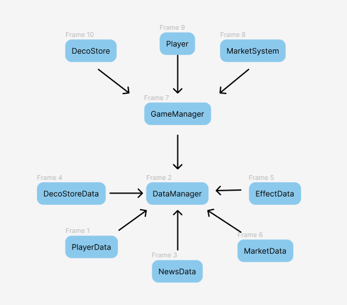

# [DataManager] 데이터 저장 과정의 개선

## 개요

- TodangTodang 구현사항 중 DataManager에 대한 구현/개선 사항에 대한 내용입니다.
- 사용 기술
    - 옵저버 패턴
    - 제네릭 메소드

<br>
<br>

## ⚠️ 개선 배경


- 저장해야 할 데이터가 추가될 때 마다 DataManager에 데이터 저장/로드 메소드를 만듬
- 데이터가 새로 생성될 때마다 DataManager를 수정해야함
- 비슷한 구조의 코드의 반복이 일어남

<br>
<br>

## 🤔 개선 과정

- 여러 개의 코드가 아닌 한 개의 코드로 관리할 수 있는 방안은 제네릭 메소드가 적합하다고 판단.
- 추가적으로 옵저버 패턴을 활용하게 된다면, 저장 대상 DataManager에 구독을 등록하고 <br>
  DataManager는 구독된 클래스들로 부터 JsonData를 받아 저장하는 하는 형태<br>

- 다만 Load과정은 JsonData를 통하고 싶었지만, 기본 데이터를 DataManager에서 관리하고 있어, 각각의 data 자식 클래스에서 참조하는 것은 코드의 결합도를 높이는 결과라고 판단,
- Load과정에서는 DataManager에서 각각의 Data를 직접 반환해주는 것으로 결정
- 이때 제네릭 메소드를 이용, 코드를 하나로 묶어서 관리할 수 있도록 만들어
코드 수정을 국소적으로 해도 되도록 수정함.

<br>
<br>

## 💡 개선 후 얻은 이점
- DataManager에서 데이터 별로 반복되던 코드를 줄일 수 있었음. 817 -> 695줄
- 데이터 추가 시 Load 관련 2개의 메소드와, DefaultData 초기화 부분에 대한 추가만 하면 데이터 추가 가능
- Save의 경우엔 데이터 쪽에서 JsonData를 생성해서 보내주기 때문에 DataManager에서는 수정 불필요

<br>
<br>

## 구현 사항


### Save과정

- Savable 라는 Base 클래스를 두고, Base클래스는 옵저버의 역할을 담당,
- Savable 를 상속하는 클래스는 자동으로 DataManager에 구독요청
- DataManager는 외부의 저장 요청이 있을 때 구독된 Savable HashSet에 JsonData를 요청
- 각각의 Data에서 JsonData를 추출해 DataManager로 반환
- 가져온 JsonData를 바탕으로 데이터를 저장(암호화, 무결성 검증 데이터 삽입)

### 관련 코드

Savable.cs

```csharp
public abstract class Savable
{
    private DataManager _dataManager;

    public Savable()
    {
        _dataManager = DataManager.Instance;
#if UNITY_EDITOR
        Debug.Assert(_dataManager, $"dataManager {Strings.DebugLog.INIT_PROBLEM} ");
#endif

        _dataManager.RegistSaveData(this);
    }

    public abstract void Init(string json, Param saveParam = null);
    public abstract string GetJsonData();

    ~Savable()
    {
        _dataManager.CancelRegistSaveData(this);
    }
}
```

DataManager.cs 중 Save 관련내용

```csharp

public void RegistSaveData(Savable saveData)
{
    _saveDatas.Add(saveData);
}

public void CancelRegistSaveData(Savable saveData)
{
    _saveDatas.Remove(saveData);
}

private void Save(string data, string path)
{
    using (StreamWriter sr = new StreamWriter(path))
    {
        string encryptingData = EncryptData(data);
        string versionAddedData = $"{Strings.SaveData.SAVE_VERSION}|{encryptingData}";
        string hashString = versionAddedData.GetHashCode().ToString();
        sr.Write($"{Strings.SaveData.SAVE_VERSION}|{encryptingData}|{hashString}");
    }
}

public void SaveAllData()
{
    foreach (Savable data in _saveDatas)
    {
        Type type = data.GetType();
        if (_filePathDic.TryGetValue(type, out string filePath))
        {
            string jsonData = data.GetJsonData();
            Save(jsonData,filePath);
        }
        else
        {   
#if UNITY_EDITOR
            Debug.LogWarning(Strings.Path.NONE_PATH);
#endif
        }       
    }
}
```

MarketData.cs 중 JsonData 반환 코드
```csharp
public override string GetJsonData()
{
    MarketSaveData marketSaveData = new MarketSaveData();
    marketSaveData.IngredientPriceStrs = new List<string>();
    marketSaveData.IngredientPriceValues= new List<int>();
    marketSaveData.IsSellableStrs = new List<string>();
    marketSaveData.IsSellableValues = new List<bool>();
    foreach (KeyValuePair<string, int> pricesKeyValue in GetIngredientPrices())
    {
        marketSaveData.IngredientPriceStrs.Add(pricesKeyValue.Key);
        marketSaveData.IngredientPriceValues.Add(pricesKeyValue.Value);
    }
    
    foreach (KeyValuePair<string, bool> sellableKeyValue in GetIsSellableDatas())
    {
        marketSaveData.IsSellableStrs.Add(sellableKeyValue.Key);
        marketSaveData.IsSellableValues.Add(sellableKeyValue.Value);
    }
    
    string jsonData = JsonUtility.ToJson(marketSaveData);
    return jsonData;
}
```
<br>
<br>

---

<br>
<br>

### Load과정
- GameManager에서 Load요청을 수행하고, 이때 제네릭 메소드로 접근하여 데이터를 가져감

### 관련 코드

- DataManager.cs의 Load 과정
 ```csharp
public void LoadData<T>(out T data) where T : Savable, new()
{
    Type dataType = typeof(T);
    data = null;
    string jsonData = null;
    if (_filePathDic.TryGetValue(dataType, out string filePath) && File.Exists(filePath))
    {
        jsonData = Load(filePath,out bool needEncrypt);
        
        if (jsonData == string.Empty || isCorrupted)
        {
            GetDefaultData<T>(dataType, out data);
        }
        else
        {
            data = new T();
						Param param = GetParam<T>();
            data.Init(jsonData,param);                
        }
        if (needEncrypt)
        {
            Save(jsonData,filePath);
        }
    }
    else
    {   
#if UNITY_EDITOR
        if(filePath == null)
            Debug.LogWarning("type에 맞는 filePath가 없습니다. 신경써주세요");
#endif
        GetDefaultData<T>(dataType, out data);
    }
}


private string Load(string path, out bool needEncrypt)
{
    string data = string.Empty;
    needEncrypt = false;
    using (StreamReader sr = new StreamReader(path))
    {
        string encrypdata = sr.ReadToEnd();
        // 추후에 버전 체크를 할 수 있게 변형할 수 있음.
        if (encrypdata.StartsWith(Strings.SaveData.SAVE_VERSION))
        {
            string[] splited = encrypdata.Split("|");
            if (splited.Length != 3)
            {
                isCorrupted = true;
                Debug.LogWarning(Strings.Data.);
                return string.Empty;
            }
            else
            {
                string hashString = $"{splited[0]}|{splited[1]}";
                int hash;
                if (int.TryParse(splited[2],out hash)&& hash == hashString.GetHashCode())
                {
                    data = DecryptData(splited[1]);
                }
                else
                {
                    isCorrupted = true;
                    Debug.LogWarning("데이터의 이상");
                    return string.Empty;
                }
            }
        }
        else if ( encrypdata.StartsWith("{"))
        {
            data = encrypdata;
            needEncrypt = true;
        }
        else
        {
            isCorrupted = true;
            Debug.LogWarning("데이터의 이상");
            return string.Empty;
        }
        
    }
    return data;
}

private void GetDefaultData<T>(Type dataType, out T data) where T : Savable
{
    data = null;
    if (dataType == typeof(PlayerData))
    {
        data = MakeDefaultPlayerData() as T;
    }
    else if(dataType == typeof(MarketData))
    {
        IngredientInfoSO[] ingredientInfoSos = GetDefaultDataArray<IngredientInfoSO>();
        data = MakeDefaultMarketData(ingredientInfoSos) as T;
    }
    else if(dataType == typeof(DecoStoreData))
    {
        data = MakeDefaultDecoStoreData() as T;
    }
    else if (dataType == typeof(NewsSystem))
    {
        data = new NewsSystem() as T;
    }
}

private Param GetParam<T>()
{
    Param data = null;
    Type dataType = typeof(T);
    if(dataType == typeof(MarketData))
    {
        MarketData.MarketDataParam param = new MarketData.MarketDataParam();
        IngredientInfoSO[] ingredientInfoSos = GetDefaultDataArray<IngredientInfoSO>();
        param.IngredientInfoSos = ingredientInfoSos;
        data = param;
    }
    else if(dataType == typeof(DecoStoreData))
    {
        DecoStoreData.DecoStoreDataParam param = new DecoStoreData.DecoStoreDataParam();
        StoreDecorationInfoSO[] storeDecorationInfoSos = GetDefaultDataArray<StoreDecorationInfoSO>();
        param._storeDecoDatas = storeDecorationInfoSos;
        data = param;
    }

    return data;
}

// 각각의 SaveData들이 자신의 초기화 변수를 담기 위함
public abstract class Param 
{
    
}
``` 
MarketData.cs(로드되는 데이터 중 하나)<br>
Init : JsonData데이터가 있을 때 로드 시 사용<br>
GetJson : 저장 시 JsonData 반환

```csharp
public override void Init(string json, Param saveParam = null)
{
    MarketDataParam marketDataParam = saveParam as MarketDataParam;
    MarketSaveData data = JsonUtility.FromJson<MarketSaveData>(json);
    _ingredientInfoList = marketDataParam.IngredientInfoSos;

    if (data != null)
    {
        for (int i = 0; i < data.IngredientPriceStrs.Count; ++i)
        {
            _ingredientPrices.Add(data.IngredientPriceStrs[i],data.IngredientPriceValues[i]);
            _isSellable.Add(data.IsSellableStrs[i],data.IsSellableValues[i]);
        }
    }
}

public class MarketDataParam : Param
{
    public IngredientInfoSO[] IngredientInfoSos;
}
```

<br>
<br>

## 개선 더 필요한 사항

### DataManager의 과도한 역할
  - 현재 구조는 DataManager가 SO와 같은 기본 데이터들을 저장하는 기능과 Save/Load 기능을 포함하고 있는 클래스임
  - 두 개를 분리해서 DataManager는 기본데이터의 관리만, SaveAndLoad는  Save와 Load기능만 관리하게 하고, 각각이 따로 BaseClass나 Interface에서 접근하도록 설계를 해 놓는다면, 기본 데이터와 SaveAndLoad 부분 간 결합도를 낮출 수 있어, 구조적으로 좋았을 것임.

### Savable와 DataManager의 관계
  - Savable에서 Save와 Load를 string 데이터만을 이용해 구현하게 한다면, 지금보다 더 간단한 구조의 Save/Load 시스템이 완성되었을 것임
  - string만을 사용하기에 지금 구조와 다르게 제네릭 메소드 없이 구현이 가능하게 됨
  - 이에 따라 DataManager에서는 수정 없이 저장 데이터를 계속해서 포함할 수 있게됨.
  - 이를 통해 간단하면서도, 코드 가독성 증대 및, 저장 데이터의 추가/삭제에 영향 전혀 없는 DataManager가 되었을 것임.